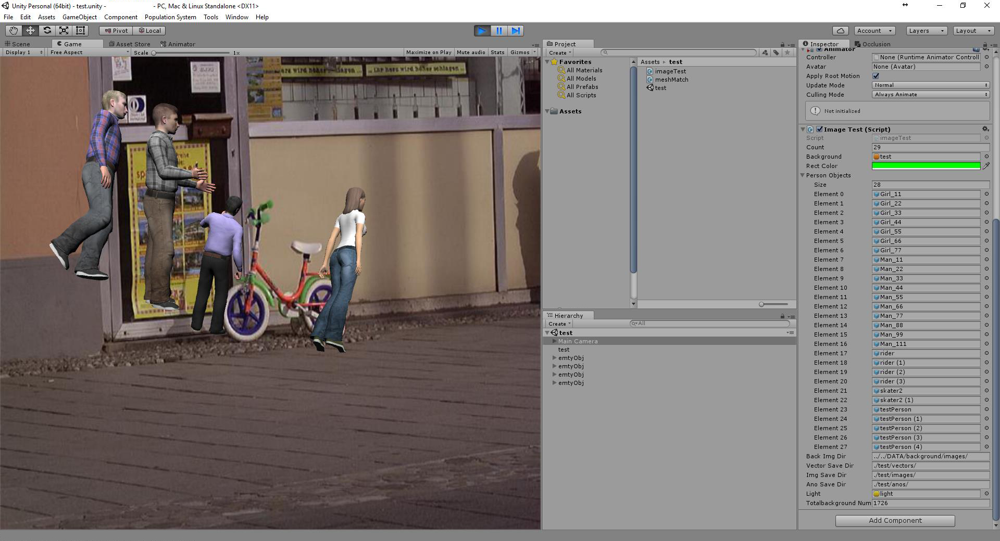

generator_synthetic_data
===============

Code accompanying the paper ["Expecting the Unexpected: Training Detectors for Unusual Pedestrians with Adversarial Imposters"](http://ml.cs.tsinghua.edu.cn:5000/publications/synunity/). This repo contains the scripts of the generator for synthetic data. Because of the copyright, we can't upload 3D models. 

## Requirement
- Windows or Mac OS
- Unity3D 5.4
- [Opencv for unity](https://www.assetstore.unity3d.com/en/#!/content/21088)

## Usage




## Dataset Download
* [Synthetic Dataset](https://drive.google.com/open?id=0BzU4ETbYHM6feVM2ZE9qNzVxeHM)

## Cite

Please cite our paper if you use this code or our datasets in your own work:

```
@article{huang2017recognition,
  title={Recognition in-the-Tail: Training Detectors for Unusual Pedestrians with Synthetic Imposters},
  author={Huang, Shiyu and Ramanan, Deva},
  journal={arXiv preprint arXiv:1703.06283},
  year={2017}
}
```

## Author
Shiyu Huang(huangsy13@gmail.com)

